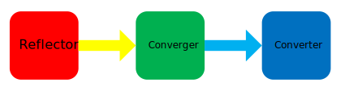

# AutoLatex #
Edit your paper by structure. 

[TOC]


----
## Introduction ##

AutoLatex is a document management tool for convenient and well structured tex edition. 

You can write sections of your paper in separated documents and manage your tex environment in a specific xml--`Env.xml` file instead of pushing anything in a giant .tex file, which makes writers dizzy and even annoy when they papers have pretty large volume. 

What is more, you are totally unnecessary to create the separated documents by yourself. What you need to do is to configure your paper structure in a specific xml--`Structure.xml` and then use a command to generate (we call it *reflect*, which is a term of java programming) the documents. 

In addition, we provide a light debug function--**lunit**, which erase the trouble to debug a section of your paper manually and you can dynamically debug any parts of your paper without needing to create, copy and paste anything. So writers will not be annoyed due to the low efficiency brought by searching their target in whole generated .pdf file any more. 


**Notice**: current version is just for linux OS and we are welcome to anyone to join the development of B/S version, which could be used in any OS and writers even do not need to install any supporting application. 

----

## For Uers ##

### Quick Start ###
1. **check**: execute checkPlugins.sh to check whether you installed all applications necessary for this tool or not. 

2. **make**: run make script in AutoLatex directory with assurance that you have the authority, which will help you configure the path environment. After that, you need to **execute** `source ~/.bashrc` to validate the configuration <u>manually</u>. If you are used to configure your path environment in other profile, you can open make and modify `file` and `path`. 

3. **create**: Then you can open your terminal where you want to start your new paper by command `tlt create your_project_name` and the input `y` to ensure you want to create the new project under current directory. If anything is ok, you will see the tree structure of your new project directory

4. **design tex environment** in `Env.xml`: If you just want to use the function of structured edition of AutoLatex, add the attribute `fast=true` to root node `<documents></documents>` and copy all tex commands before `\begin{document}` to the text part of `<documents></documents>` instead of configuring environment by xml labels just like the examples in `Env.xml` do. 

5. **design your paper structure** in `Structure.xml`: different from tex gramme which uses cascaded `sub` key word to mark the section level, you can name each section, subsection and  section with arbitrary subordinate level by the same xml label--`<section></section>` and the level of the section is marked by indent, just like

    ```xml
    <sections name="Documents" id="">
        <section name="Introduction" id="I">
        	<section name="Method" id="A">
            </section>
        </section>
    </sections>
    ```

    You may already notice that `Structure.xml` need a root node `<sections></sections>` and each node of xml needs to have attribute `name` and `id`, which are the name and number of the section, respectively. However, `id` is possible to be set in void just like `<sections></sections>` does or be set in arbitrary content and it is just used to help you to be clear about your paper structure. (the `name` attribute of `sections` node must be `Documents`) 

6. **reflect**: run command `tlt reflect` to generate documents structure for your paper, you can also execute it when you

    - rename one section
    - delete one section
    - add as many sections as you want

    tips: for security of your documents, reflect command just allows the aforementioned situations and any illegal setting of `Structure.xml` will not be accepted. 

    Then you can see the directories and initialized tex files of each section in `Documents`. 

7. **write your paper** in separated documents.

8. **run command** `tlt convert --force` and `tlt compile` to generate .pdf file and you will see the target with name `${your_project_name}.pdf` in the directory `Target`.

not satisfy? just coordinate configuration file (`Env.xml`, `Structure.xml`) or your paper content in documents and run commands. 

### Manual ###


----

## For Advanced Users ##

Design XML Label-Java Class for Yourself

### Mapping Relationship

In this subsection, we will introduce mapping relationship between xml label and java class. The previous one is used to configure tex commands and document structure, which is a kind of abstract of a block of tex content. The latter one provides three parts of a tex content block. The three parts are called prefix, text and postfix. The following picture shows the mapping relation among .tex content block, xml label and java class. 


We abstract the .tex content block to xml label for convenient management and this process can be expressed as
$$
T_{tex2xml}(·)
$$
and its inverse operator 
$$
T^{-1}_{tex2xml}=T_{xml2tex}
$$
is the called converter, which is dependent to the dynamic library of java class called as **resolvers**, i.e.
$$
T_{xml2tex}(·)=T_{xml2tex}(·;resolvers)
$$

### Pluggable Resolvers

*Emphases*

- *class registration file*: `LabelConfig.ini`
- `[P]` *decorator for registration*
- *Two kind of resolvers*

Just as mentioned previously, the java class library is dynamic, which means the converter knows what resolvers it can use **only** when the program actually runs and the class configuration file is loaded by the program. 

#### `ini` Configuration

You can find a `LabelConfig.ini` file in each project directory and the typical and default content is just like the followings: 

```ini
[documents]
;legal items in <documents></documents>
documents=com.takamagahara.converter.envNodes.Documents
newcommands=com.takamagahara.converter.envNodes.NewCommands
renewcommands=com.takamagahara.converter.envNodes.RenewCommands
captionsetups=com.takamagahara.converter.envNodes.CaptionSetups
other=com.takamagahara.converter.envNodes.SimpleNodePrototype
usepackages=com.takamagahara.converter.envNodes.Packages
document=com.takamagahara.converter.envNodes.document.Document
;==========add your own xml label-EnvNode mapping=============

;=============================================================


[document]
;legal items in <document></document>
document=com.takamagahara.converter.envNodes.document.Document
body=[P]com.takamagahara.converter.envNodes.document.Body
abstract=[P]com.takamagahara.converter.envNodes.document.Abstract
title=com.takamagahara.converter.envNodes.document.Title
keywords=com.takamagahara.converter.envNodes.document.Keywords
IEEEpeerreviewmaketitle=com.takamagahara.converter.envNodes.document.IEEEpeerreviewmaketitle
ifCLASSOPTIONcaptionsoff=com.takamagahara.converter.envNodes.document.IfCLASSOPTIONcaptionsoff
bibliConfig=com.takamagahara.converter.envNodes.document.BibConfig
;==========add your own xml label-EnvNode mapping=============

;=============================================================


[body]
;Body is not a container, this configuration section is used to
;    provide strategies for Body to support different elements in
;    papers like figure, table and algorithm.
;You can add your own strategies to expand the function of Body.
;Read manual for more details.
body=[P]com.takamagahara.converter.envNodes.document.Body
;body section special configuration
figure=com.takamagahara.converter.envNodes.document.body.Figure
insert=com.takamagahara.converter.envNodes.document.body.Insert
;==========add your own xml label-strategy mapping=============

;=============================================================
```

You can see three sections in the `ini` file named `documents`, `document` and `body` and you may already notice that there is a special mark `[P]` in the configuration file, which means a kind of special class that their constructors need the path of the project. 

The keys in `ini` the file mean the label of `Env.xml` or the label of special content (figures, tables and so on) in `Structure.xml`and the values mean the full name of the class so that the converter will know which labels it can convert and where the corresponding java class, the resolvers, can be found. 

#### Container and Convertee

Each section means a **Container** which contains other resolvers (except the default text resolver `body` and we will explain the fact that you can slice the .tex file into blocks by yourself and the scope of resolvers can be defined by advanced users) and the common classes are called **convertee**. 

##### 1) Container


##### 2) Convertee


### Process to Add Your Own XML label and the Corresponding Resolver

You can configure each project with a different library and just be sure that you correctly configure the `ini` file. 


### Example 1: A New Environment Command


### Example 2: A New Strategy for Text


----

## For Developers or Anyone Interesting to Source Code ##

This section is dedicated to the introduction of technologies used in the development of this tool, you can [download](https://github.com/KingHaremIII/AutoLatex-java) the source code of core java implementation engine and manipulate it in arbitrary way you want. Contact us without hesitation if you have any advice or comments by <u>Kouzuyao@outlook.com</u>. 

### Explanation of Items in AutoLatex ###



### Core Components ###

